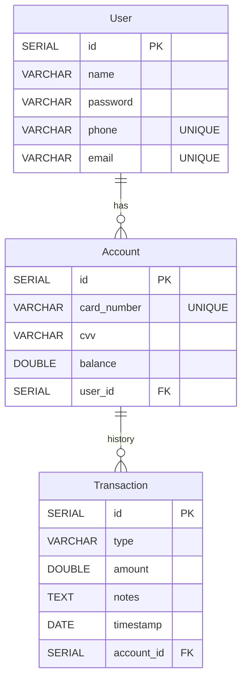

# Bank Management System

Welcome to the Bank Management System repository built using Spring Boot! This project is designed to provide a foundation for managing banking operations using modern web technologies.

## Table of Contents

- [Introduction](#introduction)
- [Features](#features)
- [Installation](#installation)
- [Usage](#usage)
- [Database Schema](#database-schema)
- [Technologies Used](#technologies-used)
- [Testing Methodologies](#testing-methodologies)
- [Contributing](#contributing)

## Introduction

The Bank Management System is a web-based application developed using Spring Boot that aims to streamline various banking operations. This system offers features to manage customer accounts and perform transactions.

## Features

- User-Friendly Web Interface: Enjoy a user-friendly web interface designed for both customers, crafted using Angular.
- Authentication and Authorization: We prioritize security by implementing robust user authentication and authorization mechanisms, guaranteeing safe and controlled access to the system.
- Multi-Account Support: Users have the convenience of creating up to three separate accounts within the system, catering to various financial needs and goals.
- Comprehensive Account Details: Customers can easily access a wealth of information about their accounts, including balance summaries, card numbers, CVV numbers, and more. This empowers users with a clear overview of their financial status.
- Efficient Transaction Handling: Our system offers well-defined API endpoints that enable seamless fund transfers between accounts. This ensures efficient and accurate transaction processing.

## Installation

To run the Bank Management System locally, you will need the following:

- Java 11 or higher version
- Maven
- PostgreSQL

Once you have the required tools installed, follow these steps to install the Bank Management System:

1. Clone this repository:
   ```shell
      git clone http
   ```
2. Edit the database configurations in application.properties file.
3. Navigate to the project directory:
   ```shell
   cd bank-management-system-springboot
   ```
4. Build and run the application using Maven
   ```shell
   mvn spring-boot:run
   ```
5. Explore the Application: Once the application is up and running, open your web browser and access it at: `http://localhost:8080`
6. Access API Documentation: Additionally, you can explore the API documentation by navigating to: `://localhost:8080/swagger-ui.html`. This provides detailed insights into the available API endpoints and functionalities.

## Usage

- Customer Actions:

  - Account Creation: As a customer, you have the privilege of creating multiple accounts tailored to your financial needs.
  - View Account Details: Easily access comprehensive details about your accounts, empowering you with insights into your balances and transactions.

- Transaction Operations:
  - Deposit Funds: Any interface can conveniently utilize the `/transaction/deposit` endpoint to securely deposit funds into specified accounts.
  - Withdraw Funds: Similarly, the `/transaction/withdraw` endpoint is available for withdrawing funds from accounts, ensuring your transactions are seamless and accurate.

## Database Schema



## Technologies Used

- Java
- Spring Boot
- Spring Security
- json web token (JWT)
- Spring Data JPA
- Lombok
- PostgreSQL
- Maven
- Swagger
- Docker

## Testing Methodologies

### Test Structure

The project follows a comprehensive testing strategy with multiple layers of testing:

1. **Repository Layer Tests** (`/repository/`)

   - Tests database operations
   - Uses H2 in-memory database
   - Focuses on data persistence and retrieval
   - Key test files:
     - `UserRepositoryTest.java`
     - `AccountRepositoryTest.java`

2. **Service Layer Tests** (`/service/impl/`)
   - Tests business logic
   - Uses Mockito for dependency mocking
   - Covers both success and failure scenarios
   - Key test files:
     - `AuthenticationServiceImplTest.java`
     - `TransactionServiceImplTest.java`
     - `AccountServiceImplTest.java`
     - `UserServiceImplTest.java`

### Testing Patterns

1. **Repository Tests**

   - `@DataJpaTest` for testing JPA repositories
   - Tests data persistence operations
   - Validates entity relationships
   - Examples:
     ```java
     @Test
     public void shouldFindUserByEmail()
     @Test
     public void shouldFindByCardNumber()
     ```

2. **Service Tests**
   - Unit tests with mocked dependencies
   - Tests business logic and workflows
   - Validates business rules
   - Examples:
     ```java
     @Test
     public void shouldDepositSuccessfully()
     @Test
     public void loginShouldLoginUserSuccessfully()
     ```

### Key Testing Features

1. **Authentication Testing**

   - User registration validation
   - Login authentication
   - JWT token generation
   - Security constraints

2. **Transaction Testing**

   - Deposit operations
   - Withdrawal validations
   - Balance checks
   - Transaction recording

3. **Account Management Testing**
   - Account creation
   - Multiple account handling
   - Card number validation
   - Balance management

### Testing Tools & Technologies

- **JUnit 5**: Testing framework
- **Mockito**: Mocking framework
- **H2 Database**: In-memory database for testing
- **AssertJ**: Fluent assertions library
- **@SpringBootTest**: Integration testing
- **@DataJpaTest**: Repository testing

### Test Coverage Areas

1. **Positive Test Cases**

   - Successful operations
   - Valid data handling
   - Expected workflows

2. **Negative Test Cases**

   - Error handling
   - Invalid data
   - Edge cases
   - Exception scenarios

3. **Security Testing**
   - Authentication
   - Authorization
   - Token validation
   - Access control

### Running Tests

1. **Run All Tests**

   ```shell
   mvn test
   ```

2. **Run Specific Test Class**

   ```shell
   mvn test -Dtest=AccountServiceImplTest
   ```

3. **Run with Coverage**
   ```shell
   mvn test jacoco:report
   ```

## Contributing

Contributions to the Bank Management System project are welcome! If you'd like to contribute:

1. Fork the repository.
2. Create a new branch for your feature.
3. Commit your changes.
4. Push the branch.
5. Open a Pull Request explaining your changes.
